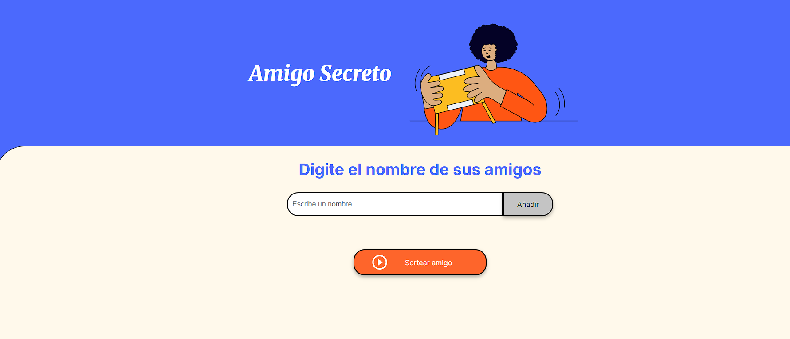
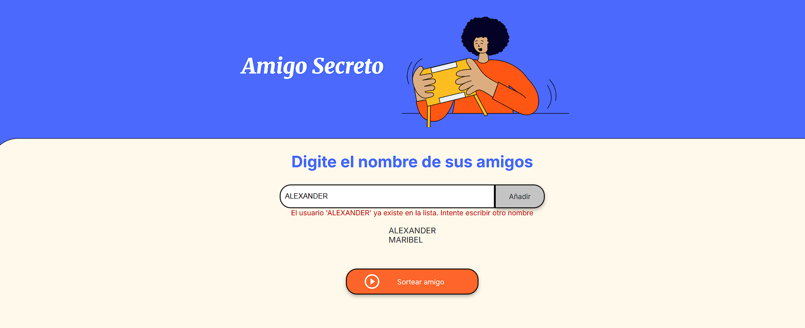
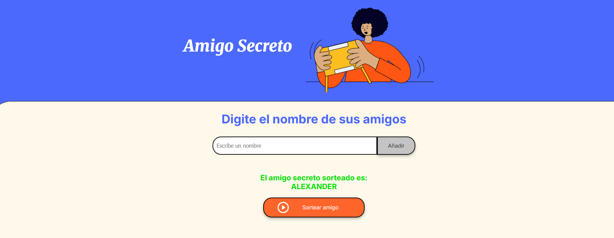

# 🎉 Sorteo de Amigos

Este es un proyecto de una página web para realizar un sorteo en el que se selecciona un amigo de una lista ingresada por el usuario. La página cuenta con validaciones para evitar campos vacíos y nombres duplicados.

## 🚀 Características

- Validación del campo de entrada (no permite valores vacíos ni duplicados).
- Botón de sorteo que selecciona aleatoriamente un amigo de la lista ingresada.
- Interfaz sencilla e intuitiva para facilitar su uso.

## 📋 Requisitos

Para ejecutar el proyecto, solo necesitas un navegador web moderno como:

- Google Chrome
- Mozilla Firefox
- Microsoft Edge

## 📂 Estructura del Proyecto

📁 challenge-amigo-secreto_esp-main
│-- 📄 index.html  (Estructura de la página)
│-- 📄 styles.css  (Estilos de la página)
│-- 📄 app.js   (Lógica del sorteo y validaciones)

## 🛠️ Instalación y Uso

1. Descarga o clona el repositorio:

   ```
   git clone https://github.com/AlexanderCarbajalMoquillaza/challenge-sorteo-amigo.git
   ```
2. Abre el archivo `index.html` en tu navegador.
3. Ingresa nombres en el campo de entrada y agrégalos a la lista.
4. Haz clic en el botón "Sortear amigo" para seleccionar aleatoriamente un amigo.

   **Nota: También puedes hacer uso de la aplicación mediante la siguiente ruta: [Amigo Secreto](https://alexandercarbajalmoquillaza.github.io/challenge-sorteo-amigo/)**

## 🖼️ Captura de Pantalla

*Pantalla principal*

*Validaciones*




*Sorteo de amigo*



## 🤝 Contribución

Si deseas mejorar el proyecto, puedes hacer un **fork** del repositorio y enviar un **pull request** con tus cambios.
